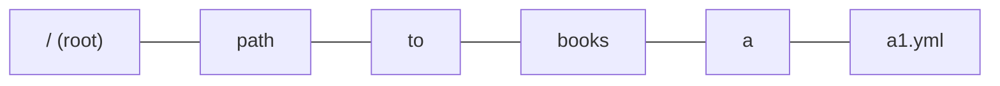
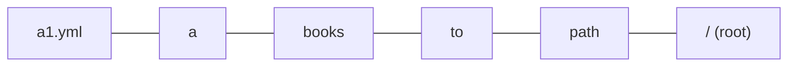

# Runbook ID design doc

Authors: @k1low, @k2tzumi

Status: Draft

## Objective

This document describes the implementation of runbook ID.

## Backgroud

runn runs multiple runbooks.
When the run of one of multiple runbooks fails, there are the following use cases

- To identify the runbook/step that failed.
- To rerun the failed runbook. Rerun environment may be different (on local, on CI)
- To modify the failed runbook and rerun it.

The ID that identifies the runbook is useful in these use cases.

### Additional requirements (if possible)

- When specifying a part of the ID, like Git commit hash, it can still identify the runbook if it is unique.
- Can rerun by `runn run ./**/*.yml --id [runbook ID]`

## Algorithm


### STEP 1. Per-runbook processing

Given the following file paths.

```
/path/to/books/a/a1.yml
/path/to/books/a/a2.yml
/path/to/books/a/aa/a1.yml
/path/to/books/b/b1.yml
...
/path/to/books/c/c1/c5.yml
```

For each absolute path, split it with a path separator and make an array.



Reverse order the elements.



### STEP 2. Processing to resolve all runbook IDs

Compare the first one of the elements in each runbook for duplicates.

```
a1.yml
a2.yml
a1.yml
b1.yml
...
c5.yml
```

If there are no duplicates, the hashed value of the first one of the elements is used as the ID of each runbook.

If there is a duplicate, compare the first two of the elements in each runbook for duplicates.

```
a1.yml/a
a2.yml/a
a1.yml/aa
b1.yml/b
...
c5.yml/c1
```

If there are no duplicates, the hashed value of the first two elements is used as the ID of each runbook.

```
hash('a1.yml/a')
hash('a2.yml/a')
hash('a1.yml/aa')
hash('b1.yml/b')
...
hash('c5.yml/c1')
```

This is checked until the ids are resolved.

## Data structure

TODO

## Alternatives considered

### Generate ID from `desc:` of runbook

No guarantee that `desc:` is unique, so other sources are needed for ID generation.

### Generate ID from `steps:` of runbook

If the `steps:` are the same, they can be considered the same runbook.

However, for fixes, when a step is modified or a new step is added, it becomes a different `steps:`, so it cannot be the source of ID generation.

### Generate ID from absolute path of runbook

Runbook file paths are unique on the file system.

And, in only a few cases do they change the file name or file path, either on rerun or when fixing a failure.

However, if the running environment is different, the absolute path of the runbook will be different.

### Generate ID from relative path of runbook

Different run paths will change the relative paths of runbooks.
