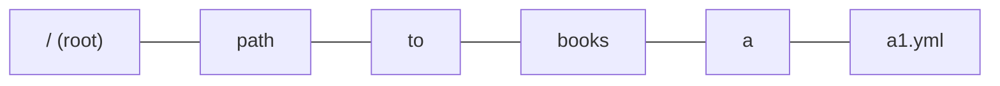
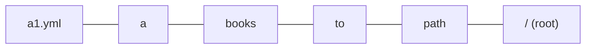
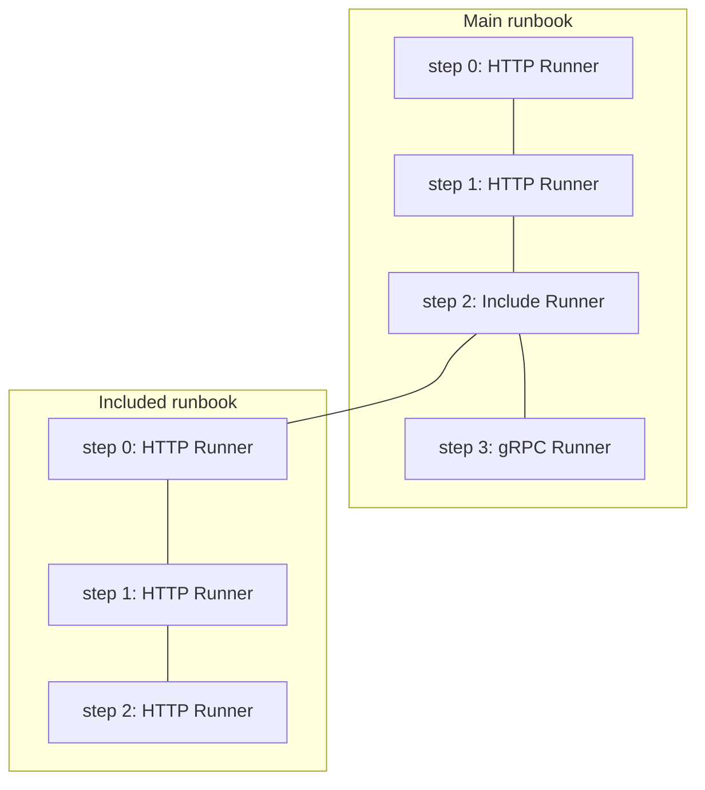

# Runbook ID design doc

Authors: @k1low, @k2tzumi

Status: Accepted

## Objective

This document describes the implementation of runbook ID.

## Backgroud

runn runs multiple runbooks.
When the run of one of multiple runbooks fails, there are the following use cases

- To identify the runbook/step that failed.
- To ensure traceability of scenario testing on the part of the testee.
    - To rerun the failed runbook. Rerun environment may be different (on local, on CI)
- To modify the failed runbook and rerun it.

The ID that identifies the runbook is useful in these use cases.

### Additional requirements (if possible)

- When specifying a part of the ID, like Git commit hash, it can still identify the runbook if it is unique.
- Can rerun by `runn run ./**/*.yml --id [runbook ID]`

## runbook ID

### Algorithm

Generate IDs using an array of absolute paths in reverse order.

**Why reverse order:**

When rerun a failed runbook, the runbook itself may be modified, but the file path of the runbook is rarely changed. In other words, the file path can be used for ID generation.

However, the environment to rerun a failed runbook may be different. That is, absolute paths are different.

Therefore, we utilize the leaves of the file path tree.

#### STEP 1. Per-runbook processing

Given the following file paths.

```
/path/to/books/a/a1.yml
/path/to/books/a/a2.yml
/path/to/books/a/aa/a1.yml
/path/to/books/b/b1.yml
...
/path/to/books/c/c1/c5.yml
```

For each absolute path, split it with a path separator and make an array.



Reverse order the elements.



#### STEP 2. Processing to resolve all runbook IDs

Compare the first one of the elements in each runbook for duplicates.

```
a1.yml
a2.yml
a1.yml
b1.yml
...
c5.yml
```

If there are no duplicates, the encoded value of the first one of the elements is used as the ID of each runbook.

If there is a duplicate, compare the first two of the elements in each runbook for duplicates.

```
a1.yml/a
a2.yml/a
a1.yml/aa
b1.yml/b
...
c5.yml/c1
```

If there are no duplicates, the encoded value of the first two elements is used as the ID of each runbook.

```
encode('a1.yml/a')
encode('a2.yml/a')
encode('a1.yml/aa')
encode('b1.yml/b')
...
encode('c5.yml/c1')
```

Keep doing this until the ids are resolved.

#### Features of this algorithm

- ID does not change depending on the execution path.
- ID does not change unless the file path changes.
- ID does not change depending on the execution environment unless the directory layout containing runbooks is changed.


- ID is determined dependent on other runbooks running at the same time.
    - For example, ID may change if the number of runbooks running at the same time increases or decreases.

### Data structure

**SHA-1 string**

The encoded result is the ID as it is.

Encoding function can be any injective function with no side effects.

- SHA-1
- MD5
- Base32
- Raw ( no encoding )

Of the above, SHA-1 and MD5 can uniquely identify an ID with a shorter string than the other functions ( They are more likely to be able to identify an ID with a shorter subset of ID than other functions ).

Also, as a result of benchmarking, it takes only about 1500ns/op to "reverse the path and hash it with SHA-1". This is fast enough.

<details>

``` console
$ lscpu
Architecture:                    x86_64
CPU op-mode(s):                  32-bit, 64-bit
Address sizes:                   46 bits physical, 48 bits virtual
Byte Order:                      Little Endian
CPU(s):                          2
On-line CPU(s) list:             0,1
Vendor ID:                       GenuineIntel
Model name:                      Intel(R) Xeon(R) CPU E5-2673 v3 @ 2.40GHz
CPU family:                      6
Model:                           63
Thread(s) per core:              1
Core(s) per socket:              2
Socket(s):                       1
Stepping:                        2
BogoMIPS:                        4794.44
Flags:                           fpu vme de pse tsc msr pae mce cx8 apic sep mtrr pge mca cmov pat pse36 clflush mmx fxsr sse sse2 ss ht syscall nx pdpe1gb rdtscp lm constant_tsc rep_good nopl xtopology cpuid pni pclmulqdq ssse3 fma cx16 pcid sse4_1 sse4_2 movbe popcnt aes xsave avx f16c rdrand hypervisor lahf_lm abm invpcid_single pti fsgsbase bmi1 avx2 smep bmi2 erms invpcid xsaveopt md_clear
Hypervisor vendor:               Microsoft
Virtualization type:             full
L1d cache:                       64 KiB (2 instances)
L1i cache:                       64 KiB (2 instances)
L2 cache:                        512 KiB (2 instances)
L3 cache:                        30 MiB (1 instance)
NUMA node(s):                    1
NUMA node0 CPU(s):               0,1
Vulnerability Itlb multihit:     KVM: Mitigation: VMX unsupported
Vulnerability L1tf:              Mitigation; PTE Inversion
Vulnerability Mds:               Mitigation; Clear CPU buffers; SMT Host state unknown
Vulnerability Meltdown:          Mitigation; PTI
Vulnerability Mmio stale data:   Vulnerable: Clear CPU buffers attempted, no microcode; SMT Host state unknown
Vulnerability Retbleed:          Not affected
Vulnerability Spec store bypass: Vulnerable
Vulnerability Spectre v1:        Mitigation; usercopy/swapgs barriers and __user pointer sanitization
Vulnerability Spectre v2:        Mitigation; Retpolines, STIBP disabled, RSB filling, PBRSB-eIBRS Not affected
Vulnerability Srbds:             Not affected
Vulnerability Tsx async abort:   Not affected
$ cat /proc/meminfo
MemTotal:        7098320 kB
MemFree:         2489904 kB
MemAvailable:    6206736 kB
Buffers:          243256 kB
Cached:          3308192 kB
SwapCached:            0 kB
Active:           477792 kB
Inactive:        3400676 kB
Active(anon):       2804 kB
Inactive(anon):   346272 kB
Active(file):     474988 kB
Inactive(file):  3054404 kB
Unevictable:       47244 kB
Mlocked:           44172 kB
SwapTotal:       4194300 kB
SwapFree:        4194300 kB
Dirty:            576544 kB
Writeback:             0 kB
AnonPages:        371444 kB
Mapped:           296236 kB
Shmem:             22936 kB
KReclaimable:     496720 kB
Slab:             563920 kB
SReclaimable:     496720 kB
SUnreclaim:        67200 kB
KernelStack:        3664 kB
PageTables:         4964 kB
NFS_Unstable:          0 kB
Bounce:                0 kB
WritebackTmp:          0 kB
CommitLimit:     7743460 kB
Committed_AS:    2217384 kB
VmallocTotal:   34359738367 kB
VmallocUsed:       34008 kB
VmallocChunk:          0 kB
Percpu:             1264 kB
HardwareCorrupted:     0 kB
AnonHugePages:    106496 kB
ShmemHugePages:        0 kB
ShmemPmdMapped:        0 kB
FileHugePages:         0 kB
FilePmdMapped:         0 kB
HugePages_Total:       0
HugePages_Free:        0
HugePages_Rsvd:        0
HugePages_Surp:        0
Hugepagesize:       2048 kB
Hugetlb:               0 kB
DirectMap4k:      104384 kB
DirectMap2M:     3041280 kB
DirectMap1G:     6291456 kB
$ go test -bench . -count 3 -run Benchmark
goos: linux
goarch: amd64
pkg: github.com/k1LoW/runn
cpu: Intel(R) Xeon(R) CPU E5-2673 v3 @ 2.40GHz
BenchmarkReversePath-2                    	 1655914	       710.6 ns/op
BenchmarkReversePath-2                    	 1282734	      1041 ns/op
BenchmarkReversePath-2                    	 1643572	       728.8 ns/op
BenchmarkSHA1-2                           	 2295310	       535.5 ns/op
BenchmarkSHA1-2                           	 2224086	       509.8 ns/op
BenchmarkSHA1-2                           	 2375605	       504.8 ns/op
BenchmarkBase32-2                         	 3652219	       342.7 ns/op
BenchmarkBase32-2                         	 3482906	       365.0 ns/op
BenchmarkBase32-2                         	 3321051	       367.4 ns/op
BenchmarkReverseAndHashBySHA1Path-2       	  753838	      1444 ns/op
BenchmarkReverseAndHashBySHA1Path-2       	  828048	      1498 ns/op
BenchmarkReverseAndHashBySHA1Path-2       	  821737	      1464 ns/op
BenchmarkReverseAndEncodeByBase32Path-2   	 1193406	       991.8 ns/op
BenchmarkReverseAndEncodeByBase32Path-2   	 1000000	      1048 ns/op
BenchmarkReverseAndEncodeByBase32Path-2   	 1258382	       958.9 ns/op
PASS
ok  	github.com/k1LoW/runn	26.963s
```

</details>

Therefore, SHA-1 is adopted.

## Specification of any step in the runbook

### Algorithm

Index each step in the runbook starting from 0.

Do the same for the steps in the runbook being included.



### Data structure

Assign to ID by URL Query format.

In the following case, step 2 of the main runbook is the Include runner, and it points to step 0 of the runbook included by the Include runner

```
[runbook ID]?step=2&step=0
```

- The only allowed key is `step`.
- Multiple same keys can be set.
- If they are the same key, they are meaningful in order.

## Alternatives considered

### Generate ID from `desc:` of runbook

No guarantee that `desc:` is unique, so other sources are needed for ID generation.

### Generate ID from `steps:` of runbook

If the `steps:` are the same, they can be considered the same runbook.

However, for fixes, when a step is modified or a new step is added, it becomes a different `steps:`, so it cannot be the source of ID generation.

### Generate ID from absolute path of runbook

Runbook file paths are unique on the file system.

And, in only a few cases do they change the file name or file path, either on rerun or when fixing a failure.

However, if the running environment is different, the absolute path of the runbook will be different.

### Generate ID from relative path of runbook

Different run paths will change the relative paths of runbooks.

## FAQ

### Loop counts are not reflected in ID?

No, they are not reflected in ID.

This is because the loop count represents the state of a run and does not identify the step in the runbook.

It is the same as a variable given externally.


